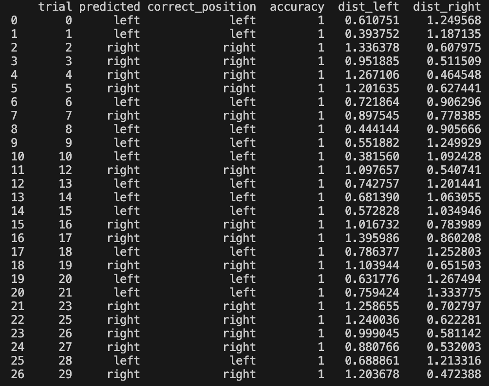

# Eyewitness Testimony Simulation with FaceNet

This project investigates the reliability of human eyewitness identification versus machine-based facial recognition using signal detection theory (SDT) and deep learning.

## Overview

This project explores the fallibility of human eyewitness memory and the potential of machine learning to model or outperform it. Inspired by real-world wrongful convictions based on faulty identifications, a 2-Alternative Forced Choice (2AFC) experiment was designed using **PsychoPy** to test whether exposure duration affects identification accuracy.

Participants were shown a suspect for either 0.4 or 1.5 seconds, followed by a brief retention interval and a two-person lineup task. Signal detection metrics (**d′**, **log β**, **λ**) were computed to assess sensitivity and decision bias. A machine “witness” was implemented using **MTCNN** and **FaceNet**, which consistently outperformed human participants on valid trials.

## Technologies Used

- Python 3
- PsychoPy (for experiment design and behavioral trials)
- `facenet-pytorch` (MTCNN + FaceNet with VGGFace2 pretrained weights)
- NumPy, Pandas (data loading and statistical analysis)
- Matplotlib (visualization of SDT metrics and model performance)

## Key Findings

- Longer exposure durations led to higher average accuracy and sensitivity in human participants, though results were not statistically significant.
- Human performance showed high variability and positional bias, with some participants defaulting to one side under time pressure.
- The machine witness, using FaceNet embeddings and distance comparisons, achieved **100% accuracy** on all detectable trials, highlighting the potential of facial recognition systems under controlled conditions.
- Findings align with cognitive literature suggesting observation time influences identification but remains vulnerable to individual differences and contextual noise.

## Model Details

### FaceNet Architecture

This project uses **FaceNet** via the `facenet-pytorch` implementation of **InceptionResnetV1**, a deep convolutional neural network pretrained to produce 512-dimensional face embeddings. FaceNet maps facial images into a compact Euclidean space where distances reflect facial similarity, enabling identity comparison through embedding distance rather than classification.

### Pretrained Model: VGGFace2

The FaceNet model was initialized with weights pretrained on **VGGFace2**, a large-scale face dataset containing over 9,000 identities and more than 3.3 million images, capturing wide variation in pose, lighting, expression, and age. This enabled robust generalization to unfamiliar faces in the experimental trials.

- Model used: `InceptionResnetV1(pretrained='vggface2')`
- Embedding size: 512-dimensional L2-normalized vector
- Original training objective: Triplet loss (used during VGGFace2 training, not fine-tuned here)

### Face Detection: MTCNN Hyperparameters

**MTCNN** (Multi-task Cascaded Convolutional Networks) was used for face detection and alignment with the following custom parameters:

- `image_size=160`: Standardized output size for FaceNet input
- `margin=20`: Padding applied around the face box to preserve context in tight crops
- `thresholds=[0.2, 0.3, 0.4]`: Detection confidence thresholds loosened to improve recognition on grayscale and low-light images
- `post_process=True`: Ensured prewhitening normalization to match FaceNet input expectations

### Embedding Comparison Metric

After embedding extraction, identity similarity was determined using **Euclidean distance** (`np.linalg.norm`). The image with the smaller distance to the encoding vector was selected as the model’s prediction, simulating a forced-choice identification decision.

## Files

- `eyewitness_trials.csv` – Metadata and image paths for each 2AFC trial
- `SDT_FACENET.py` – Main script for running machine trials, extracting embeddings, and computing performance
- `get_embedding()` – Extracts FaceNet embeddings after detecting faces with MTCNN and resolving preprocessing artifacts
- `run_trials()` – Processes all trials, logs detection errors, and compares machine predictions to correct labels

## Instructions

1. Clone the repo and place all experiment images and `eyewitness_trials.csv` in the root directory.
2. Open `SDT_FACENET.py` and update `FILE_PATH` to match your local directory.
3. Run the script to simulate FaceNet’s performance and generate results.
4. (Optional) Enable debug face crop saving inside `get_embedding()` to visualize the detected face regions.

## Notes

- **Face detection failures** are logged in `error_log`; these often occur due to extreme angle, lighting, or cropping.
- **Black speckling artifacts** in early face crops were resolved by rescaling tensors from `[-1, 1]` to `[0, 1]` prior to saving images.
- `post_process=True` ensures prewhitening normalization is applied to tensors before they are passed to FaceNet.

## Limitations

- The sample size of human participants was limited to 30 college students, which may restrict generalizability across broader populations or high-stress eyewitness scenarios.
- Each participant completed 30 trials (15 per condition), which, while sufficient for basic signal detection analysis, may be underpowered for detecting subtle or interaction effects.
- Face matching performance was tested using still images with controlled lighting and pose; real-world variability such as motion blur, occlusion, or dynamic expressions was not included.

## Future Work

- Increase participant sample size and number of trials per condition to improve statistical power and enable analysis of individual differences in recognition sensitivity and bias.
- Introduce additional experimental variables such as stress induction, time pressure, or environmental distractions to better simulate real-world eyewitness conditions.
- Expand the facial image dataset to include greater variation in pose, lighting, and expression, as well as incorporate video frames to simulate dynamic observation.
- Compare different facial recognition architectures (e.g., ArcFace, DINOv2) or retrain FaceNet on task-specific data to evaluate model generalizability.
- Extend the model to support full lineup identification (nAFC) and explore probabilistic decision thresholds or confidence scoring based on embedding distance margins.

## Full Report

For a detailed discussion of the experiment design, results, statistical tests, and comparison to cognitive psychology literature, see the full write-up:

📄 [SDT_Report.pdf](SDT_Report.pdf)

## Author

Cody Lejang  
B.S. in Cognitive Science, Specialization in Computing, minor in Data Science Engineering – UCLA

Signal Detection & Machine Learning  
April 2025
